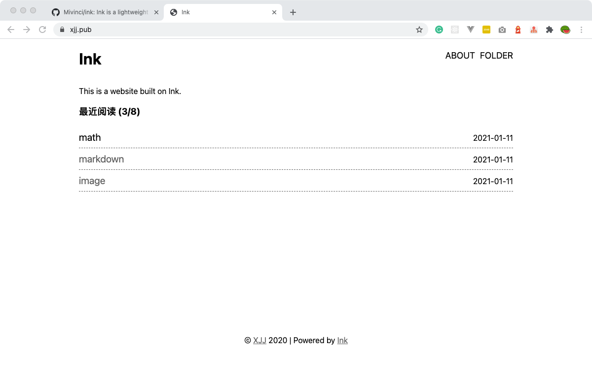
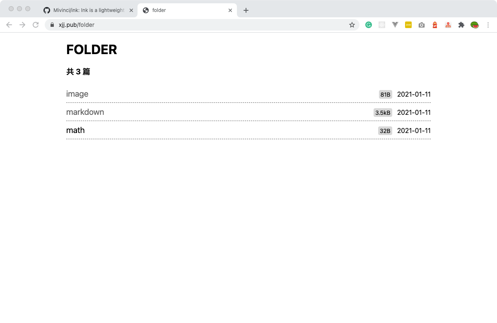

# Ink

Ink is a lightweight blog server, mapping directories to URLs. All its codes are written in one single file - [main.go](https://github.com/Mivinci/ink/blob/main/main.go) - with only 500 lines of codes (including comments). [Click me](https://xjj.pub/about) to view more details about Ink.

Demo site: [https://xjj.pub](https://xjj.pub)

Screenshots:

